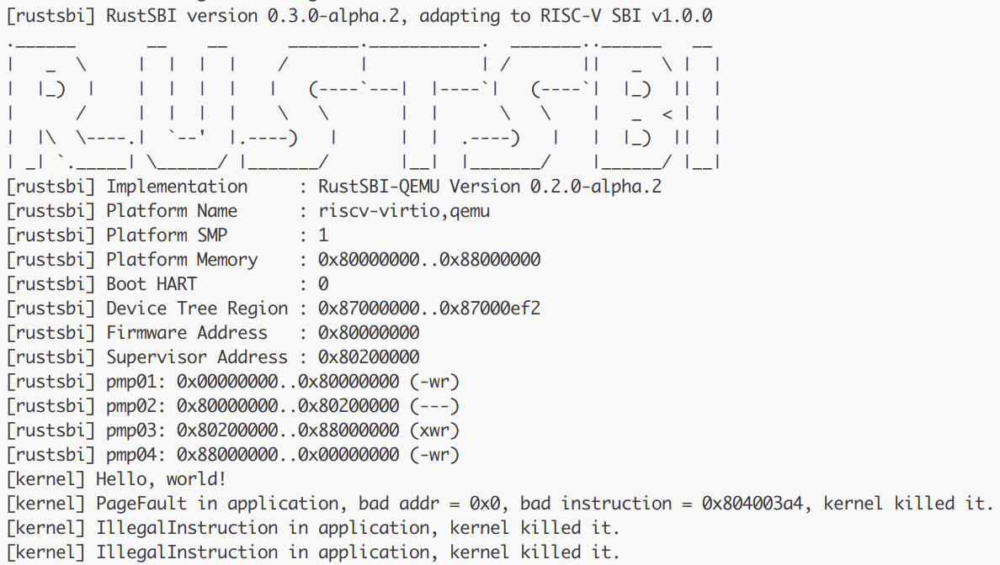

## 功能总结

实现了系统调用 `sys_trace`，支持以下三类操作：

1. **读取操作**（`trace_request = 0`）：从当前任务的 `id` 地址处读取一个字节的无符号整数。
2. **写入操作**（`trace_request = 1`）：将 `data` 的最低字节写入当前任务的 `id` 地址处。
3. **查询调用次数**（`trace_request = 2`）：返回当前任务对系统调用编号为 `id` 的累计调用次数（包含本次查询）。

## 问答题

### 1
### 

#### 运行三个 bad 测例，依次报错：

#### PageFault
```text
[kernel] PageFault in application, bad addr = 0x0, bad instruction = 0x804003a4, kernel killed it.
```
- ```PageFault``` 错误:  
  当程序试图访问一个非法或未映射的内存地址时，会发生页错误。这里，程序试图访问 ```0x0``` 地址，这是空指针，通常是内存访问的非法行为。由于操作系统的内存保护机制，它会捕捉到这个错误并生成 ```PageFault```。

- ```bad instruction = 0x804003a4```:  
  这是出错时 CPU 执行的指令地址。这个信息可能有助于调试，但本质上，它只是标识出程序出错的位置。

- ```kernel killed it```:  
  内核检测到异常并终止了程序，防止其继续运行，确保系统稳定性。


#### IllegalInstruction
非法指令

#### IllegalInstruction
非法指令

#### RustSBI
```RustSBI``` 版本为 ```0.3.0-alpha.2```

### 2.1

在 ```__restore``` 函数刚开始执行时：  
- ```now sp->kernel stack(after allocated), sscratch->user stack```
- 此时 sp 指向的是内核栈中分配好 ```TrapContext``` 的位置，也就是 ```trap_handler()``` 返回后，仍保留的中断现场保存区域（总共 34 个 64 位寄存器的大小）。

####  __restore 的两种使用情景

- 中断/异常处理后恢复用户态
1. 在 ```__alltraps``` 中，硬件触发中断或异常。
保存所有用户寄存器后，调用 ```trap_handler```, 
```trap_handler``` 处理完毕后，返回后立即进入 ```__restore。```
```__restore``` 恢复 ```TrapContext```（寄存器、sepc、sstatus 等），然后通过 ```sret``` 回到用户态。

2. 执行 ```exec()``` 系统调用后的上下文切换
   在某些系统调用（如 ```exec()```）之后，用户空间已经完全换了（加载了新程序）。
此时也会构造一个新的 ```TrapContext```，让用户程序“假装”是从一次中断中回来。
这时不会经历真正的中断，但仍然调用 ```__restore``` 来跳转执行用户代码。

### 2.2

```text
ld t0, 32*8(sp)     # 恢复 sstatus
ld t1, 33*8(sp)     # 恢复 sepc
ld t2,  2*8(sp)     # 恢复 sscratch（保存的用户态 sp）

csrw sstatus, t0
csrw sepc, t1
csrw sscratch, t2
```
依次保存了 ```sstatus```, ```sepc```, ```sscratch```

- ```sstatus```  
  给出 Trap 发生之前 CPU 处在哪个特权级（S/U）等信息,确保返回用户态时仍是用户模式。
- ```sepc```  
  当 Trap 是一个异常的时候，记录 Trap 发生之前执行的最后一条指令的地址,当执行 ```sret``` 时，CPU 会跳转到 ```sepc``` 处继续执行。

- ```sscratch```  
  用来临时存储用户态的 ```sp```。在 ```__alltraps``` 中通过 ```csrrw``` 保存了用户栈指针。这里恢复到 ```sscratch```，并在 ```__restore``` 尾部再用 ```csrrw``` 恢复为真正的 ```sp```，把栈重新切回用户栈。

### 2.3

#### sp(x2) 寄存器, 当前 sp 是内核态的栈，而用户态的 sp 被保存在 sscratch 中，最后通过：```csrrw sp, sscratch, sp``` 来统一恢复。
#### tp(x4) 寄存器,（Thread Pointer）用于线程局部存储（TLS）,目前也不会被用到。

### 2.4
该指令交换了 ```sp``` 和 ```sscratch``` 中的值。交换后
- ```sp```  
  被恢复为 用户栈 的 ```sp``` 值
- ```sscratch```  
  变成原来的内核栈指针


### 2.5

#### sret 后发生状态切换进入用户态

```sret``` 的行为是：
- 从 ```sepc``` 恢复程序计数器（PC），跳转回用户态程序陷入之前的位置。
- 从 ```sstatus``` 中恢复处理器的关键控制位，包括 SPP（当前特权级）和 SPIE（中断使能）。


### 2.6
交换当前的 ```sp``` 和 ```sscratch``` 寄存器中的值,即用户栈指针存到 ```sscratch```,把内核栈指针写入 ```sp```

### 2.7

当执行 ```ecall``` 时，硬件会自动触发 ```trap```，进入 S 态，并跳转到 ```stvec``` 所设定的入口地址，也就是 ```__alltraps```


## 荣誉准则

1. 在完成本次实验的过程（含此前学习的过程）中，我曾分别与 以下各位 就（与本次实验相关的）以下方面做过交流，还在代码中对应的位置以注释形式记录了具体的交流对象及内容：

        使用了 Chatgpt 交流了有关汇编与Rust语法上的问题

2. 此外，我也参考了 以下资料 ，还在代码中对应的位置以注释形式记录了具体的参考来源及内容：

        《rCore-Tutorial-Guide-2025S》
		    《rCore-Tutorial-Book-v3》

3. 我独立完成了本次实验除以上方面之外的所有工作，包括代码与文档。 我清楚地知道，从以上方面获得的信息在一定程度上降低了实验难度，可能会影响起评分。

4. 我从未使用过他人的代码，不管是原封不动地复制，还是经过了某些等价转换。 我未曾也不会向他人（含此后各届同学）复制或公开我的实验代码，我有义务妥善保管好它们。 我提交至本实验的评测系统的代码，均无意于破坏或妨碍任何计算机系统的正常运转。 我清楚地知道，以上情况均为本课程纪律所禁止，若违反，对应的实验成绩将按“-100”分计。